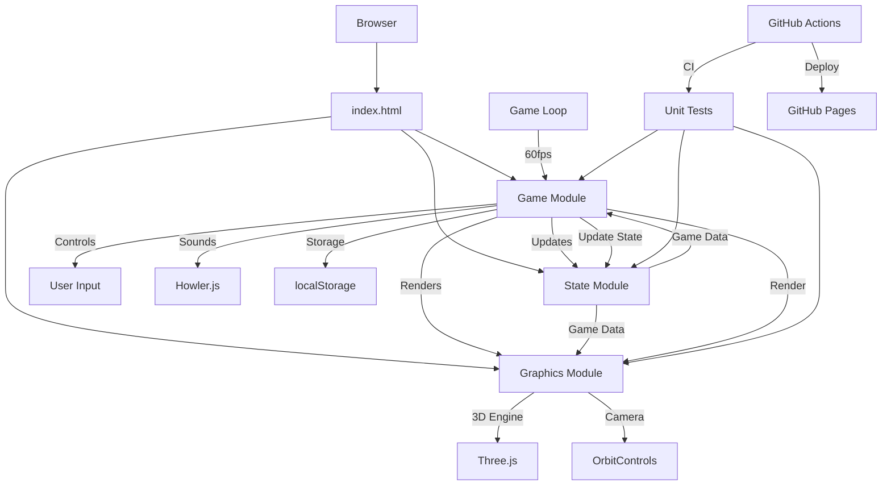

# 3D Snake Game

A modern 3D implementation of the classic Snake game built with JavaScript and Three.js.

Demo: https://aungaung-drlinuxer.github.io/windsurf-snake/

## Features

- **3D Graphics**: Built with Three.js for immersive 3D visuals
- **Dynamic Camera**: Orbit controls for viewing the game from multiple angles
- **Power-ups**: Collect special power-ups for double points and enhanced gameplay
- **Sound Effects**: Immersive audio feedback with background music
- **Score Tracking**: Local high score persistence using localStorage
- **Leaderboard**: Submit your scores to a global leaderboard (requires backend)
- **Responsive Design**: Adapts to different screen sizes

## Architecture

The game follows a modular architecture with clear separation of concerns:



### Core Modules

1. **State Management (`state.js`)**
   - Centralized game state using Three.js Vector3 objects
   - Tracks snake position, direction, score, and game settings
   - Manages power-up states and timing

2. **Game Logic (`game.js`)**
   - Main game loop and animation handling
   - Input processing (keyboard controls)
   - Collision detection (walls, self, food, power-ups)
   - Score management and high score persistence
   - Sound effects coordination

3. **Graphics Rendering (`graphics.js`)**
   - Three.js scene setup and management
   - 3D object creation and positioning
   - Camera controls with OrbitControls
   - Lighting and visual effects
   - Real-time rendering updates

4. **User Interface (`index.html`)**
   - Game container and canvas element
   - Score display and game overlays
   - Game over screen with restart functionality
   - Responsive design for different screen sizes

### Data Flow

1. **Initialization**: Browser loads `index.html` which initializes all modules
2. **Game Loop**: Continuous 60fps loop that updates state and renders graphics
3. **Input**: Keyboard events update the next direction in state
4. **Update**: Game logic processes movement, collisions, and state changes
5. **Render**: Graphics module visualizes the current state
6. **Persistence**: High scores saved to localStorage

## Project Structure

### Core Files
- `index.html` - The main HTML file that loads the game with 3D rendering context
- `game.js` - Main game logic and core functionality including game loop and controls
- `graphics.js` - Handles all the 3D rendering and visual elements using Three.js
- `state.js` - Manages the game state including snake position, score, and settings

### Configuration
- `package.json` - Project dependencies and scripts
- `babel.config.js` - Babel configuration for JavaScript transpilation
- `setupTests.js` - Test setup configuration

### Assets
- `sounds/` - Directory containing sound effects and background music
- `404.html` - Custom 404 page for GitHub Pages deployment

### Tests
- `__tests__/` - Unit tests for game mechanics and state management

### CI/CD
- `.github/workflows/ci.yml` - Continuous integration workflow for running tests
- `.github/workflows/deploy.yml` - Deployment workflow for GitHub Pages

## Getting Started

### Prerequisites
- Node.js (v14 or higher)
- npm (comes with Node.js)

### Installation
1. Clone the repository:
   ```bash
   git clone https://github.com/AungAung-Drlinuxer/windsurf-snake.git
   cd windsurf-snake
   ```

2. Install dependencies:
   ```bash
   npm install
   ```

### Running the Game
Open `index.html` in your web browser to play the game locally.

### Development
To run the development server with live reloading:
```bash
npm run dev
```

### Testing
To run tests:
```bash
npm test
```

To run tests in watch mode:
```bash
npm run test:watch
```

### Building
To build the project for deployment:
```bash
npm run build
```

## Game Mechanics

### Controls
- **Arrow Keys** or **WASD** - Control the snake direction
- **Mouse** - Orbit camera around the game board

### Gameplay
1. Guide the snake to eat the red food spheres
2. Each food item increases your score and makes the snake longer
3. Avoid hitting the walls or the snake's own body
4. Collect blue power-up spheres for double points for 10 seconds
5. The game speeds up slightly as your score increases

## Deployment

The game is automatically deployed to GitHub Pages on every push to the `main` branch. The deployment is handled by the GitHub Actions workflow in `.github/workflows/deploy.yml`.

For manual deployment:
1. Build the project: `npm run build`
2. Deploy the contents of the `dist/` folder to your web server

## Technical Details

### 3D Engine
This game uses [Three.js](https://threejs.org/) for 3D rendering:
- Green cube for snake head
- Teal cubes for snake body segments
- Red sphere for food
- Blue glowing sphere for power-ups
- Grid-based game board with ambient and directional lighting

### Audio
Audio is handled by [Howler.js](https://howlerjs.com/):
- Background music
- Food collection sound
- Power-up activation sound
- Power-up expiration sound
- Game over sound

### State Management
The game uses a centralized state management system:
- Vector-based positioning (x, y, z coordinates)
- Direction tracking with prevention of 180-degree turns
- Score and high score tracking with localStorage persistence
- Power-up timing and activation states

## License
This project is open source and available under the [MIT License](LICENSE).
